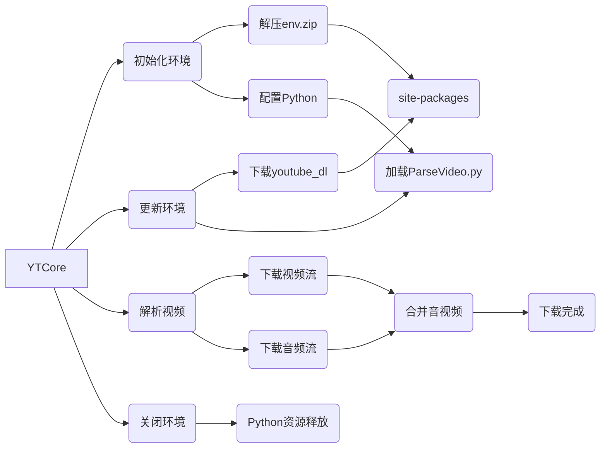

# YTCore
YTCore 是一个用于iOS平台处理 YouTube 视频解析、下载功能的 iOS 框架。



### 环境
```
开发环境:
Xcode 版本：14.1 (14B47b)
操作系统：MacOS Ventura 13.2

支持的 iOS 版本：
iPhoneOS 11.0+
```


### 编译
```
$ git clone https://github.com/LiuKaoji/YTCore.git
$ cd YTCore
$ chmod +x init.sh
$ ./init.sh
```

### 使用
```
#import <YTCore/YTCore.h>

// 创建 YTCoreUtility 实例
YTCoreUtility *ytCoreUtility = [[YTCoreUtility alloc] init];

// 设置代理
ytCoreUtility.delegate = self;

// 初始化资源
[ytCoreUtility setup];

// 更新依赖库
[ytCoreUtility update];

// 解析 YouTube 视频
[ytCoreUtility parseVideoWithURLString:@"https://www.youtube.com/watch?v=dQw4w9WgXcQ" showPanel:YES];

// 检查 YouTube 连接
[ytCoreUtility checkConnection];

// 关闭环境并释放资源
[ytCoreUtility tearDown];
```

### 注意
```
本工具不含梯子
```

# 引用
- [FFMPEG](https://github.com/FFmpeg/FFmpeg.git)
- [PYTHON](https://github.com/beeware/Python-Apple-support.git)
- [leixiaohua](https://github.com/leixiaohua1020)
- [YYModel](https://github.com/ibireme/YYModel.git)
